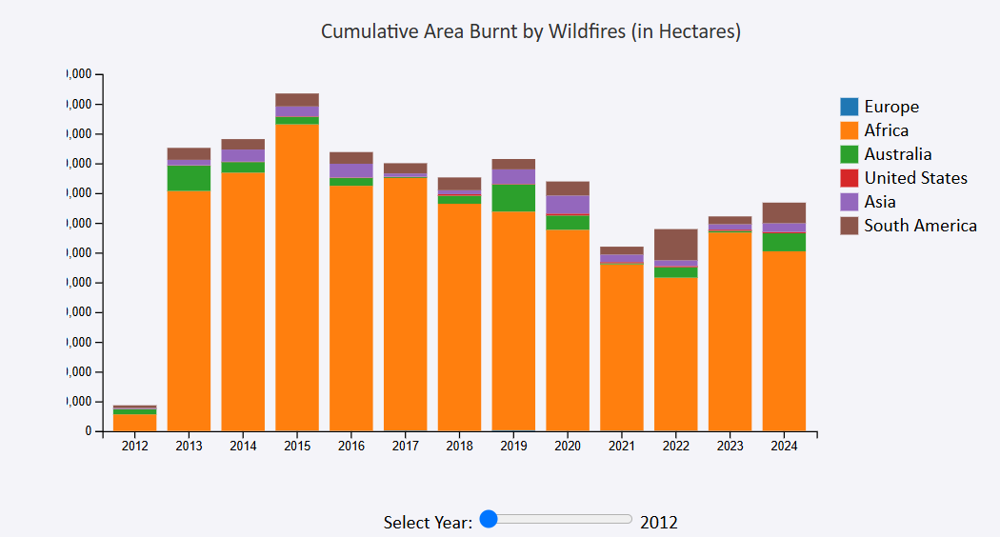
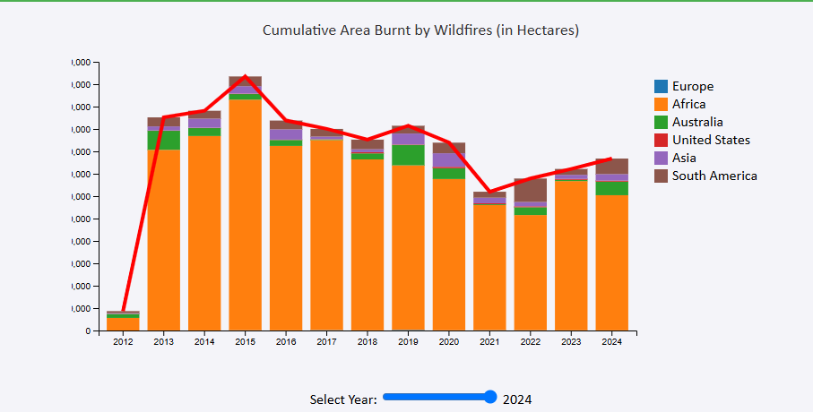

# Project Overview

## How I Went About This Design

Data set source: https://www.kaggle.com/datasets/willianoliveiragibin/wildfires

Video narration: https://youtu.be/JmTsjO_iiAE

### Step 1: Choose a Dataset
- **Dataset Selection:** wht I looked fo in this dataset was meaningful attributes that lend themselves well to various types of visualizations (e.g., time series, categories, numerical measures).
- This dataset we downloaded form Kaggele : Oliveira, Willian. *Wildfires Dataset*. Kaggle, 2024, https://www.kaggle.com/datasets/willianoliveiragibin/wildfires.

  ###Attributes included
  - Entity: Name of the country or region.
  - Code: Country or region code.
  - Year: Indicates a yearly index (though not clear how this relates to actual years).
  - Wildfire data for individual years: (e.g., area burnt by wildfires in 2024, ...in 2023)

  ###Questions Asked about this data
   1. Which regions have seen the most significant increase or decrease in wildfire-affected areas over time?
   2. Which country or region had the highest or lowest area affected by wildfires in a given year?
   3. How do different regions compare in terms of wildfire impact over a particular time span?
   4. What was the total area affected by wildfires worldwide in a specific year?
   5. Which year had the highest total area burnt by wildfires for certain countries?
   6. Which continents or larger regions are most affected by wildfires?
   7. Are there any years that stand out due to an unusual increase or decrease in wildfire activity?

### Step 2: Designing the  Visualization
- Stacked Bar Chart: Represent percentage changes for a given time period.
- Line Chart: Show trends over time for each region.
- Scatter plot: Color regions based on wildfire trends.
- The bar chart displays the total area burnt by wildfires across different continents from 2012 to 2024. The y-axis represents the area burnt in hectares, ranging from 0 to 12,000,000 hectares. The x-axis represents the years from 2012 to 2024.
- **Interactive Elements:** Add hover effects, tooltips, zoom, and filtering options to enhance interactivity.

###Color Coding
- Each continent is represented by a different color:
- Blue: Europe
- Orange: Africa
- Green: Australia
- Purple: United States
- Brown: Asia
- Red: South America

  ###Skeches :
  
  
  - The color scheme is visually appealing to ensures each region is clearly distinguishable. The consistent use of these colors across both the stacked bar chart and the legend aids in keeping the chart intuitive.
  - The legend is well-placed and provides clear information about which color corresponds to each region.
  
### Step 3: Data Preparation
- **Loaded the data using D3 data loading tools.**
- **Cleaned the data to handle any null values, outliers, or inconsistencies.**
- **Parsed attributes by converting strings to numerical types where necessary.**
- Aggregate the total area burned by wildfires for each region (or group of countries) per year.
- Calculate the year-over-year percentage change or absolute change in area burned for each region.

### Step 4: Set Up Your HTML Page
- **Created SVG containers.**
- **Bound data to visual elements.**
- **Appended visual elements (e.g., bars, lines, circles).**

### Step 5: Implement Interactivity
- Interaction using Slider for Year Selection: The slider provides great interactivity, allowing users to explore the cumulative area burnt for each year. The design of the slider is straightforward and intuitive. The text below the slider dynamically updates to show the selected year, which ensures that users can immediately see their selection.
- Tooltip: The tooltip responsiveness to mouseover events provides valuable contextual information such as the exact area burnt, total area burnt, and the percentage of the total for each region.

### Step 6: Testing
- **Checked for errors in the browser console and corrected issues with data binding, scales, or rendering.**
- **Ensured the visualization adapts to different screen sizes or viewports for accessibility.**

### Step 7: Add Explanatory Elements
- **Titles and Labels:** Included clear titles and axis labels for context.
- **Legends:** Provided legends to show different entities used in the charts.
- Stacked Bar Chart: The stacked bar chart is an excellent choice for visualizing the area burnt by wildfires across continents. It clearly shows the contributions of each region over time, with each region represented by distinct colors (using D3’s color scheme).
- Tooltip: The tooltip offers additional context, which is a great feature that enhances the interaction by allowing users to see exact values and percentages.
- Line Chart for Cumulative Area: The line chart is a brilliant addition as it provides an intuitive way to track the overall cumulative burn area over the years. By using the slider, users can see how the total area burnt accumulates, giving them a better sense of the scale of wildfire activity over the years.
- Yearly Range on X-Axis: Changing the x-axis to represent the year from 2012 to 2024 is essential for ensuring that users can track yearly trends.

### Step 8: Documentation
- **Created a README or user guide explaining how to use the visualization and the insights it offers.**

## Key Observations

Fig 1: Showing the stacked bar chart

Fig2: Showing the combined stacked barchat and line chart

### Africa (orange) Dominates
Africa consistently has the largest area burnt by wildfires each year. This indicates significant wildfire activity on this continent over the years.

### Peak in 2015
The total area burnt peaked in 2015, reaching close to 11,000,000 hectares. This year stands out as the highest wildfire activity during the period.

### Decline in 2024
There is a noticeable decline in the area burnt in 2024 compared to previous years. This could suggest a reduction in wildfire incidents or effective fire management strategies.

### Other Continents
While Africa is the most affected, other continents like Europe, Australia, the United States, Asia, and South America also contribute to the total burnt area but to a smaller extent. Europe (blue), Australia (green), and the United States (purple) show relatively stable but lower wildfire activities compared to Africa. Asia (brown) and South America (red) have the least contribution to the total area burnt by wildfires.

### Initial Low in 2012
The area burnt in 2012 is significantly lower than in other years. This might suggest fewer wildfire occurrences at the beginning of the period.

## Trends and Changes

### Overall Trend
There is a fluctuation in wildfire activity over the years, with some years showing peaks and others showing declines.

### Yearly Variation
The data points to various factors that could influence wildfire activity, such as climatic conditions, human interventions, and natural vegetation changes.

## Conclusion
The visualization focuses on clarity and user experience. It allows users to easily explore the wildfire data across continents and years while providing detailed contextual information through tooltips and a slider. The main strengths of the design are its interactivity, clarity, and effective data presentation. With a few improvements, it could further enhance the user experience.

## Reference
Oliveira, Willian. *Wildfires Dataset*. Kaggle, 2024, [https://www.kaggle.com/datasets/willianoliveiragibin/wildfires](https://www.kaggle.com/datasets/willianoliveiragibin/wildfires).

